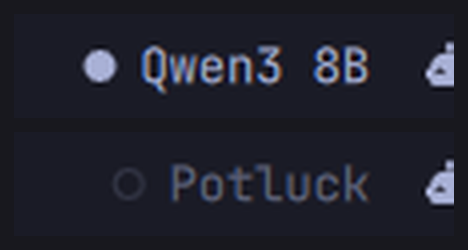

# Potluck — Omarchy bar widget

Shows [Potluck](https://trypotluck.ai) local-AI status in the Omarchy bar: whether
the sidecar is running, which model is loaded, its context window, and free RAM.



| Dot | Meaning |
|---|---|
| Filled | Sidecar up, a model is loaded and ready to serve |
| Hollow | Sidecar up, no model loaded |
| Dim hollow | Potluck is not running |

Hover for detail (model, context, installed models and disk used, RAM, GPU).
Left-click launches or focuses the Potluck app; middle-click forces a refresh.

## Install

```bash
omarchy plugin add https://github.com/newtorob/omarchy-potluck.git --enable --yes
omarchy bar move newtorob.potluck --section right
```

## Ask overlay

`SUPER + A` summons **Ask Potluck**: type a question, get a streamed answer from
the local model without opening the app.

- **Enter** send · **Tab** switch to the usage view · **Esc** cancel a stream, then close
- Reasoning-model `<think>` blocks are separated from the answer rather than
  dumped into it, so the reply stays readable.
- Streams via `curl -N` into a `SplitParser`, the same shape the first-party
  `omarchy.disk-speedtest` plugin uses for line-oriented output.

Rebind by editing the `o.bind("SUPER + A", ...)` line in `~/.config/hypr/bindings.lua`.

## Usage view

Press **Tab** in the overlay. Shows total asks, total tokens, aggregate and best
tok/s, and a recent-ask list.

Usage is **measured by this plugin as it streams**, not read back from Potluck.
The local chat route persists no per-message token telemetry — only the cloud
gateway path returns a `usage` block — so what the overlay observes is the only
honest source. Tokens are counted as streamed deltas, which tracks llama.cpp's
one-token-per-chunk output closely but is an approximation, and the rate is
aggregate (total tokens over total time), so one long ask is not outweighed by a
two-token one.

State lives in `~/.local/state/omarchy-potluck/usage.json`, capped at 200 entries.
It never leaves the machine.

## Install (overlay included)

The overlay is a second `kind` on the same plugin, so it needs an entry in
`plugins[]` alongside the bar-widget's `bar.layout` entry:

```bash
omarchy plugin add https://github.com/newtorob/omarchy-potluck.git --enable --yes
omarchy plugin enable newtorob.potluck --section right
```

Note `plugins[]` entries in `shell.json` are objects (`{"id": "..."}`), not bare
strings — a bare string silently reads as "not enabled".

## Settings

| Key | Default | What it does |
|---|---|---|
| `sidecarUrl` | `http://127.0.0.1:8321` | The Potluck local sidecar |
| `refreshIntervalSec` | `10` | Poll interval, 2–300s |
| `showModelName` | `true` | Off shows just the dot — suits a vertical bar |
| `launchCommand` | `omarchy-launch-or-focus potluck-ai-desktop potluck-ai-desktop` | Left-click action |

## Privacy

The widget only ever talks to the Potluck sidecar on loopback — the same local
process the desktop app itself uses. It sends nothing off the machine, and reads
only `/health`, `/models`, and `/hardware`. It requires no credentials and never
touches your account or the cloud API.

## Requires

Potluck installed and running. Without it the widget renders its dim
"not running" state rather than disappearing, so the click target stays
available to launch the app.

## License

AGPL-3.0
