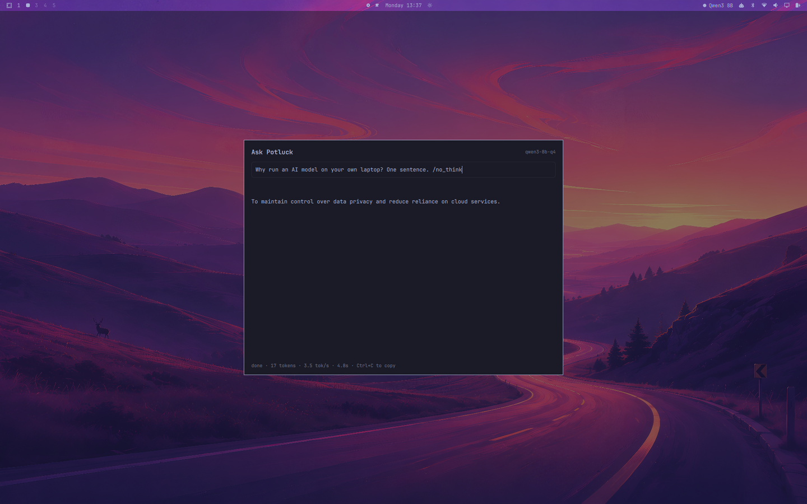

# Potluck — Omarchy plugin

[Potluck](https://trypotluck.ai) local-AI in the Omarchy bar, plus an Ask
overlay that streams from the local model without opening the app.

## Bar widget


| Dot | Meaning |
|---|---|
| Filled | Sidecar up, a model is loaded and ready to serve |
| Hollow | Sidecar up, no model loaded |
| Dim hollow | Potluck is not running |

Hover for detail: model and context window, installed models and disk used,
free RAM, GPU. Left-click launches or focuses the app; middle-click forces a
refresh.

## Ask overlay



Summon it with a keybinding (see below): type a question, get a streamed answer
from the local model.

- **Enter** send · **Tab** switch to the usage view · **Esc** cancel a stream, then close
- Reasoning-model `<think>` blocks are separated from the answer rather than
  dumped into it, so the reply stays readable.
- Streams via `curl -N` into a `SplitParser`, the same shape the first-party
  `omarchy.disk-speedtest` plugin uses for line-oriented output.

## Usage view


Press **Tab** in the overlay. Total asks, total tokens, aggregate and best
tok/s, and a recent-ask list.

Usage is **measured by this plugin as it streams**, not read back from Potluck.
The local chat route persists no per-message token telemetry — only the cloud
gateway path returns a `usage` block — so what the overlay observes is the only
available source. Two consequences worth stating plainly:

- Tokens are counted as streamed deltas. That tracks llama.cpp's
  one-token-per-chunk output closely, but it is an approximation.
- It covers **only asks made through this overlay**, not chats in the Potluck app.

Rates are aggregate (total tokens over total time), so one long ask is not
outweighed by a two-token one.

State lives in `~/.local/state/omarchy-potluck/usage.json`, capped at 200
entries. It never leaves the machine.

## Install

```bash
omarchy plugin add https://github.com/newtorob/omarchy-potluck.git --enable --yes
omarchy plugin enable newtorob.potluck --section right
```

The overlay is a second `kind` on the same plugin, so it needs an entry in
`plugins[]` as well as the bar widget's `bar.layout` entry — `omarchy plugin
enable` handles both. If you edit `shell.json` by hand, note that `plugins[]`
entries are objects (`{"id": "newtorob.potluck"}`), not bare strings; a bare
string silently reads as "not enabled".

Then bind a key to summon the overlay, in `~/.config/hypr/bindings.lua`:

```lua
o.bind("SUPER + A", "Ask Potluck", "omarchy-shell shell toggle newtorob.potluck")
```

Note that editing overlay QML needs `omarchy restart shell`; `rescanPlugins`
does not reload an already-instantiated `keepLoaded` overlay. Bar-widget edits
hot-reload normally.

## Settings

| Key | Default | What it does |
|---|---|---|
| `sidecarUrl` | `http://127.0.0.1:8321` | The Potluck local sidecar |
| `refreshIntervalSec` | `10` | Bar widget poll interval, 2–300s |
| `showModelName` | `true` | Off shows just the dot — suits a vertical bar |
| `launchCommand` | `omarchy-launch-or-focus potluck-ai-desktop potluck-ai-desktop` | Left-click action |

## Requirements and dependencies

- **Omarchy** with the Quickshell-based `omarchy-shell` (third-party plugin API,
  `bar-widget` and `overlay` kinds).
- **Potluck** installed and running. Without it the bar widget renders its dim
  "not running" state rather than disappearing, so the click target stays
  available to launch the app; the overlay reports the sidecar as unreachable.
- **`curl`** — the overlay streams Server-Sent Events through `curl -N`.

Nothing else. Nothing is bundled or downloaded at install time.

## Removal

```bash
omarchy plugin remove newtorob.potluck
```

That removes the checkout and its `shell.json` entries. Two things it does not
touch, because the plugin did not create them:

```bash
# the keybinding, if you added one
sed -i '/newtorob.potluck/d' ~/.config/hypr/bindings.lua && hyprctl reload

# recorded usage history
rm -rf ~/.local/state/omarchy-potluck
```

## Privacy

The plugin only ever talks to the Potluck sidecar on loopback — the same local
process the desktop app uses. It reads `/health`, `/models`, and `/hardware`,
and posts to `/chat/completions` when you ask something. It sends nothing off
the machine, needs no credentials, and never touches your Potluck account or
the cloud API.

It writes to exactly one path outside its own checkout —
`~/.local/state/omarchy-potluck/usage.json` — and never modifies your Hyprland,
shell, or Potluck configuration.

## License

AGPL-3.0. See [LICENSE](LICENSE).
